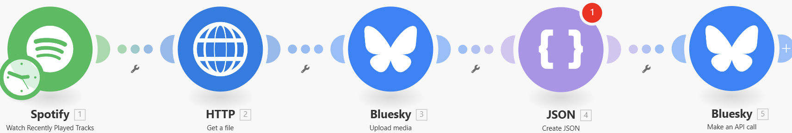
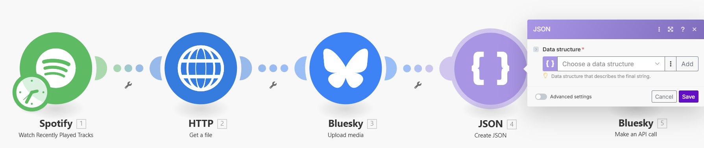
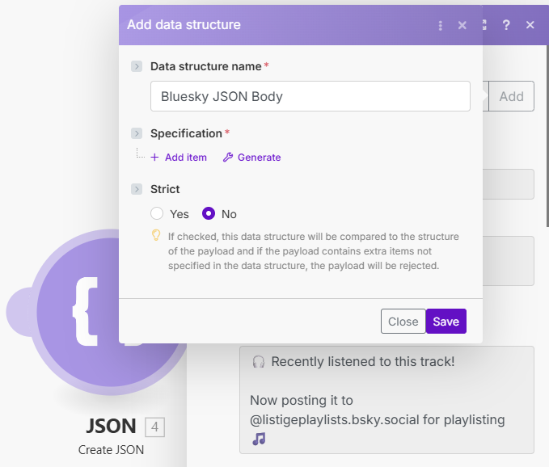
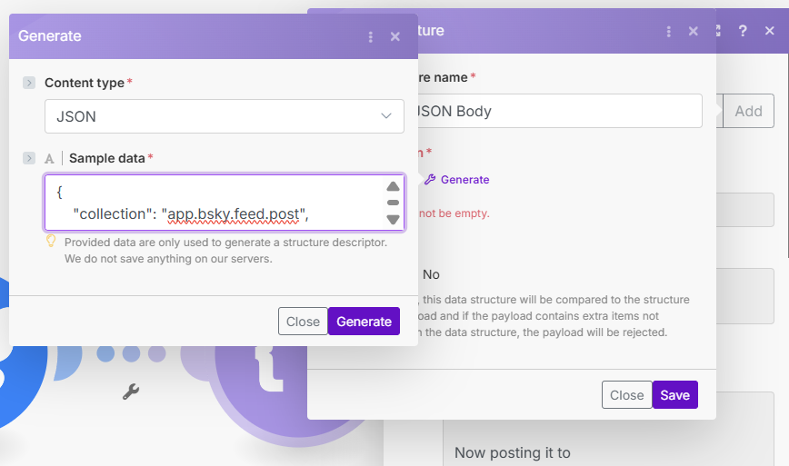

# Spotify Now Playing to Bluesky for ListigePlaylists

This Make.com blueprint automatically shares your currently playing Spotify track to Bluesky, making it easy to contribute to the [@listigeplaylists.bsky.social](https://bsky.app/profile/listigeplaylists.bsky.social) curated playlist\!

Perfect for music lovers who want to share their listening habits and contribute to the community playlist without any manual effort.

## What This Does

Every time you play a new track on Spotify, this automation will:

1.  Detect your currently playing song
2.  Download the album artwork
3.  Create a beautiful Bluesky post with:
      - Song title and artist name
      - Album artwork
      - Link to the track on Spotify
      - A mention to @listigeplaylists.bsky.social

## How It Works

You can see a live example of this automation running every four hours on our showcase profile: [TinkerHack on Bluesky](https://bsky.app/profile/tinkerhack.bsky.social).

## Make.com Free Plan Information

This blueprint works with Make.com's free plan\! Here's what you need to know:

  - **Free plan gives you:** 1,000 operations per month
  - **This scenario uses:** 5 operations per run
  - **Maximum runs per month:** 200 runs (1,000 ÷ 5)

## Scheduling Options

The blueprint schedule is preset to run **every 4 hours**. With this setting, you should be able to post for the entire month using the 1000 free credits you receive. If you want to post more frequently, you can simply change the interval, but be aware that your free credits will run out before they are renewed.

### Option 1: Conservative Schedule (Recommended and Preset for Free Plan)

**Run every 4 hours**

  - **Runs per day:** 6 (24 hours ÷ 4 hours)
  - **Runs per month:** \~180 (6 × 30 days)
  - **Operations used:** \~900 (180 × 5)
  - **Remaining buffer:** 100 operations

This schedule ensures you stay well within free plan limits while still capturing your listening activity throughout the day. It's also less "spammy" on Bluesky, giving your followers a nice overview of your music taste without overwhelming them.

### Option 2: Frequent Schedule (For More Active Sharing)

**Run every 15 minutes**

  - **Runs per day:** 96 (24 hours × 60 minutes ÷ 15 minutes)
  - **Runs per month:** \~2,880 (96 × 30 days)
  - **Operations required:** \~14,400 (2,880 × 5)

⚠️ **Important:** This option would exceed the free plan limits within the first day\! To use this schedule, you would need a paid Make.com plan.

### Customizing Your Schedule

You can set any schedule that works for you\! Here's how to calculate your usage:

**Formula:**
Operations per month = (24 ÷ hours between runs) × 30 days × 5 operations.

To stay within the free plan (1,000 operations), the minimum time between runs should be 3.6 hours. Setting it to run every 4 hours or more will keep you within free limits.

## Setup Instructions

### Step 1: Import the Blueprint

1.  [Download the blueprint file](https://github.com/TinkerHack/TheToolbox/blob/main/Make.com/SpotifyNowPlayingToBlueskyListigePlaylists/Spotify%20Now%20Playing%20to%20Bluesky%20ListigePlaylists.blueprint.json)
2.  Go to [Make.com](https://make.com) and create a free account
3.  Click "Create a new scenario" → "Import blueprint" → Upload the downloaded file

### Step 2: Create Data Structure for Bluesky
After importing, the fourth module, "Create JSON", will show an error. This is expected! We fix it with these steps:

1.  Click on the fourth module with the JSON icon to open its settings.



2.  A popup will now appear. At the top, you'll see "Data structure". Click the **Add** button next to the field.



3.  A new "Add data structure" guide will open.
    - In the **Data structure name** field, enter exactly `Bluesky JSON Body`.
    - Then, click the **Generator** button under **Specification**.

    

4.  A final popup will appear. "Content type" should already be set to "JSON". Paste the entire code block below into the **Sample data** field.

```json
{
    "collection": "app.bsky.feed.post",
    "repo": "your-handle.bsky.social",
    "record": {
        "text": "My post text",
        "$type": "app.bsky.feed.post",
        "createdAt": "2024-01-01T12:00:00.000Z",
        "embed": {
            "$type": "app.bsky.embed.external",
            "external": {
                "uri": "[https://spotify.link](https://spotify.link)",
                "title": "Song Title",
                "description": "Artist Name",
                "thumb": {
                    "$type": "blob",
                    "ref": {
                        "$link": "link-to-blob"
                    },
                    "mimeType": "image/jpeg",
                    "size": 10000
                }
            }
        },
        "facets": [
            {
                "index": {
                    "byteStart": 59,
                    "byteEnd": 88
                },
                "features": [
                    {
                        "$type": "app.bsky.richtext.facet#mention",
                        "did": "did:plc:id"
                    }
                ]
            }
        ],
        "langs": [
            "en"
        ]
    }
}
````



5.  Click **Generate**. Make.com will now automatically build the structure.
6.  Click **Save**, to save the ongoing **Add data structure** settings.
7.  Click **Save**, to save the ongoing **JSON Module** settings.


### Step 3: Configure the Bluesky Post

This is a crucial step to ensure the post is made from your account.

1.  In the scenario, click on the fourth module again (the one with a JSON icon, labeled "Create JSON").
2.  In the `repo` field, replace the text `[REPLACE WITH YOUR HANDLE HERE].bsky.social` with your own Bluesky handle.
      - **Example:** `yourname.bsky.social`.
3.  Click "OK" to save the changes.

### Step 4: Connect Your Accounts

1.  **Spotify Connection:**

      - Click the Spotify module
      - Click "Add" → "Connect to Spotify"
      - Log in to your Spotify account and authorize Make.com

2.  **Bluesky Connection:**

      - Click the Bluesky module
      - Click "Add" → "Connect to Bluesky"

    > 💡 **Security Tip:** Recommend creating a dedicated app password for this integration instead of using your main Bluesky password:

    > 1.  Go to [Bluesky Settings](https://bsky.app/settings)
    > 2.  Select "Privacy & Security"
    > 3.  Click "App Passwords"
    > 4.  Create a new password (e.g., "Make.com Integration")
    > 5.  Use this generated password when connecting Make.com to Bluesky

      - Log in to your Bluesky account using the app password
      - Authorize Make.com to access your account

### Step 5: Test Run (Optional but Recommended)

Before you set the final schedule, it's a good idea to test the scenario to make sure everything is working correctly.

1.  Make sure you are currently playing a song on Spotify for more than 30 seconds.
2.  Click the **Run once** button in the bottom-left corner of the Make.com editor.
3.  Check your Bluesky profile to see if the post was created successfully.

If the post appears as expected, you're good to go! If not, please refer to the [Troubleshooting](#troubleshooting) section at the end of this guide for common issues.

### Step 6: Set Your Schedule

1.  Click the clock icon at the top of your scenario
2.  Choose your preferred schedule:
      - **Recommended for free plan:** Every 4 hours (240 minutes)
      - **For more active sharing:** Every 15 minutes (requires paid plan)
      - **Custom:** Select "Custom" and set your desired interval
3.  Click "OK" to save

### Step 7: Activate the Scenario

1.  Click the "On/Off" switch at the bottom right
2.  Confirm activation when prompted

That's it\! Your scenario will now automatically post your currently playing tracks to Bluesky according to your schedule.
That's it\! Your scenario will now automatically post your currently playing tracks to Bluesky according to your schedule.

## Troubleshooting

  - **Scenario not running?** Make sure you've activated it and the schedule is set correctly.
  - **Posts are not appearing on my profile?** Double-check that you have correctly replaced the placeholder in the `repo` field with your own Bluesky handle in **Step 3**.
  - **Missing posts?** The scenario only captures new tracks played after activation.
  - **Credits running low?** You can check your usage in Make.com under "Operations" in the left menu.
  - **Too many posts?** Increase the time between runs in your schedule settings.

## Need Help?

If you run into any issues:

1.  Check Make.com's help documentation
2.  Reach out to [@listigeplaylists.bsky.social](https://bsky.app/profile/listigeplaylists.bsky.social) for community support

Enjoy sharing your music journey with the Bluesky community\! 🎵
